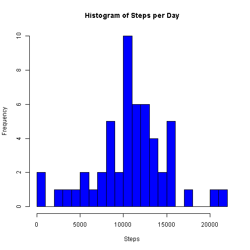
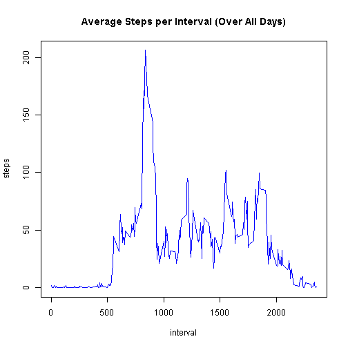
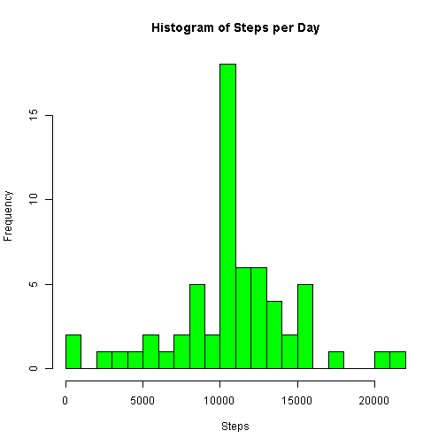
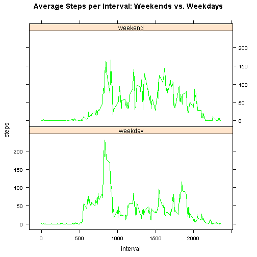

---
title: "Reproducible Research: Peer Assessment 1"
author: "Coursera repdata-032 Assessment 1"
date: "Tuesday, September 15, 2015"
output: 
  html_document:
    keep_md: true
------

###Purpose:

This analysis summarises activity in terms of steps taken throughout the day. 
Raw data consist of step counts in 5-minute time bins. The duration of the  
experiment is 2 months.

Prerequisites (modify as required):

```r
library(dplyr)
library(lubridate)
library(lattice)
setwd("E:/R_data/Course5_Ass1")   # Nb. input data file is in subfolder "/data"
```


## Loading and preprocessing the data


```r
rawdat <- read.csv("./data/activity.csv", header=TRUE) 
dat <- data.frame(date = as.Date(rawdat$date), interval = rawdat$interval, 
                  steps = rawdat$steps)
rm("rawdat")
```
Nb. From this point onward, *dat* will be copied but not modified.


## What is mean total number of steps taken per day?
 
Ignore the missing values in the dataset:

```r
dat.good <- subset(dat, !is.na(dat$steps))
```

Total number of steps taken per day:

```r
stepsbyday <- tapply(dat.good$steps, dat.good$date, sum)
hist(stepsbyday, breaks = 20, main = "Histogram of Steps per Day", 
     xlab = "Steps", col="blue")
```

 

```r
print(paste0("Median steps per day: ", median(stepsbyday)))
```

```
## [1] "Median steps per day: 10765"
```

```r
print(paste0("Mean steps per day: ", round(mean(stepsbyday), 3)))
```

```
## [1] "Mean steps per day: 10766.189"
```


## What is the average daily activity pattern?

Copy dataset into a data frame table, group by *interval*:

```r
dat.tbl <- group_by(tbl_df(dat.good), interval)
```

Interval means over all days:

```r
stepsbyinterval <- summarise(dat.tbl, avgsteps = mean(steps))
plot(stepsbyinterval, type = "l", 
     main = "Average Steps per Interval (Over All Days)", 
     ylab = "steps", col="blue")
```

 

```r
print(paste0("Interval with highest average number of steps: ", 
    stepsbyinterval$interval[which.max(stepsbyinterval$avgsteps)]))
```

```
## [1] "Interval with highest average number of steps: 835"
```


## Imputing missing values


```r
print(paste0("Number of missing values (steps): ", sum(is.na(dat$steps))))
```

```
## [1] "Number of missing values (steps): 2304"
```

Replace missing values with interval means:

```r
dat.filled <- dat
for (i in seq_along(stepsbyinterval$interval)) {
    fsteps <- stepsbyinterval$avgsteps[i] 
    finterval <- stepsbyinterval$interval[i]
    dat.filled$steps[dat.filled$interval == finterval 
                     & is.na(dat.filled$steps)] <- fsteps
}
```

Revised interval means over all days:

```r
stepsbyday <- tapply(dat.filled$steps, dat.filled$date, sum)
hist(stepsbyday, breaks = 20, main = "Histogram of Steps per Day", 
     xlab = "Steps", col="green")
```

 

```r
print(paste0("Median steps per day: ", round(median(stepsbyday), 3)))
```

```
## [1] "Median steps per day: 10766.189"
```

```r
print(paste0("Mean steps per day: ", round(mean(stepsbyday), 3)))
```

```
## [1] "Mean steps per day: 10766.189"
```

Inference (1): The mean is unchanged by this imputation, because replacing an 
NA by the mean value has no effect on the mean of the resulting distribution. 

Inference (2): The imputed median has become equal to the mean, because 13% of 
the data have been made equal to the mean, and the distribution is not noticeably 
skewed; therefore, this repeated value dominates the middle of the distribution, 
where the median occurs.


## Are there differences in activity patterns between weekdays and weekends?

Create a factor variable to distinguish day type:

```r
dat.filled$daytype <- as.factor(ifelse(weekdays(dat.filled$date) %in% c("Saturday", "Sunday"), "weekend", "weekday"))
```

Group by *daytype* and *interval*:

```r
dat.tbl <- group_by(dat.filled, daytype, interval)
```

Compare activity patterns by day type:

```r
stepsbyinterval <- summarise(dat.tbl, avgsteps = mean(steps))
xyplot(avgsteps ~ interval | daytype, data=stepsbyinterval, type="l", layout=c(1,2), 
       main="Average Steps per Interval: Weekends vs. Weekdays", ylab="steps", col="green")
```

 

Inference (1): There are more steps per interval during the weekday morning peak 
than the same period of weekend days, presumably because the subject is walking 
(quickly) to work.

Inference (2): There are more steps taken after the morning peak on weekends than 
weekdays, presumably because the subject is freely active during the weekend days 
but relatively deskbound during weekdays. 
